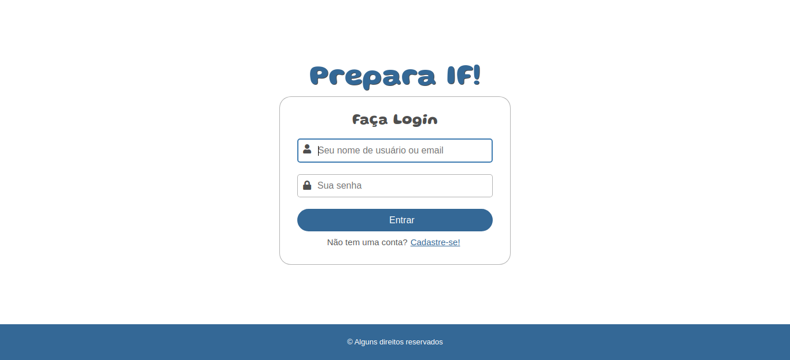

### Prepara IF

Sistema Web desenvolvido para disciplina de Desenvolvimento de Projetos no IFRN de Mossoró, com o intuito de ajudar quem quer entrar no Instituto Federal, disponibilizando provas e gabaritos de anos anteriores, simulado com questões de anos anteriores e dicas de redação e de estudo.

O sistema foi construído do zero com PHP, HTML, CSS e um pouco de JavaScript e faz uso de uma biblioteca do PHP chamada PHPMailer (https://github.com/PHPMailer/PHPMailer) para envio de e-mails em determinada parte do sistema onde o usuário pode vir a esquecer sua senha e um e-mail é enviado para o e-mail do usuário cadastrado previamente no sistema.

[Clique aqui e veja um vídeo demonstrativo do sistema](https://www.linkedin.com/posts/mateusesm_ifrn-html-css-activity-6929454810656055296-ujLB?utm_source=share&utm_medium=member_desktop)

O Sistema dispõe de Login e Cadastro de usuário (comum e administrador), várias funções para o usuário comum e funções exclusivas para usuários administradores além de ser responsivo em diversos dispositivos.

O sistema também conta com provas e gabaritos de anos anteriores do integrado e subsequente além de simulados baseados em questões reais (no momento somente simulados de matemática).

Todos os dados, seja de usuários, provas e gabaritos e simulados com suas questões e respostas são armazenados em um banco de dados MySQL em uma estrutura de tabelas relacionais previamente moldada.

#### Abaixo estão algumas imagens:

#### Página principal externa do sistema

#### Página de Login e de Cadastro do Sistema

